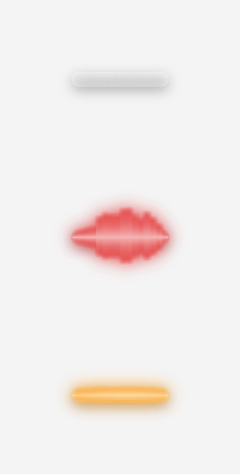
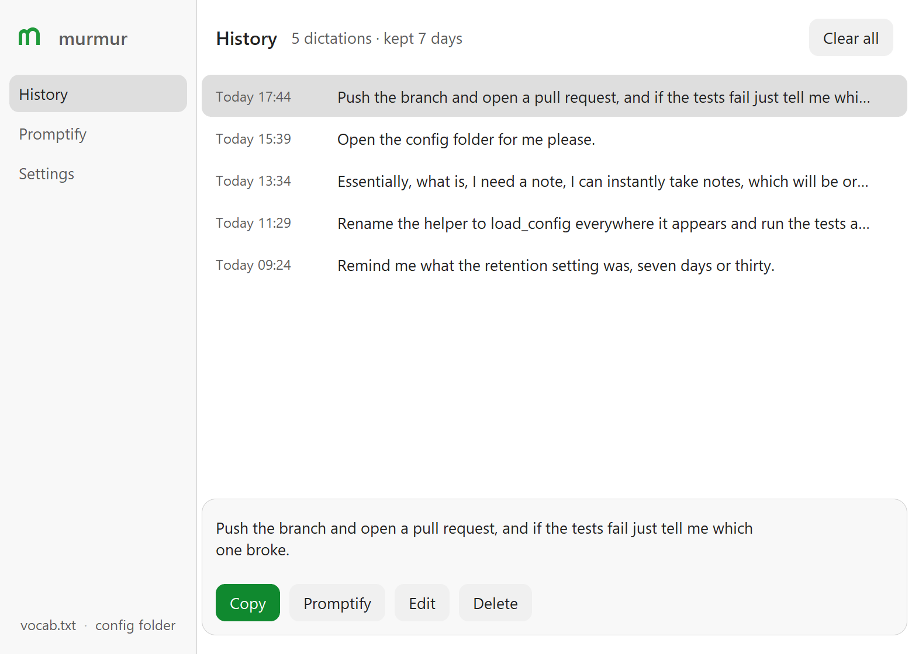
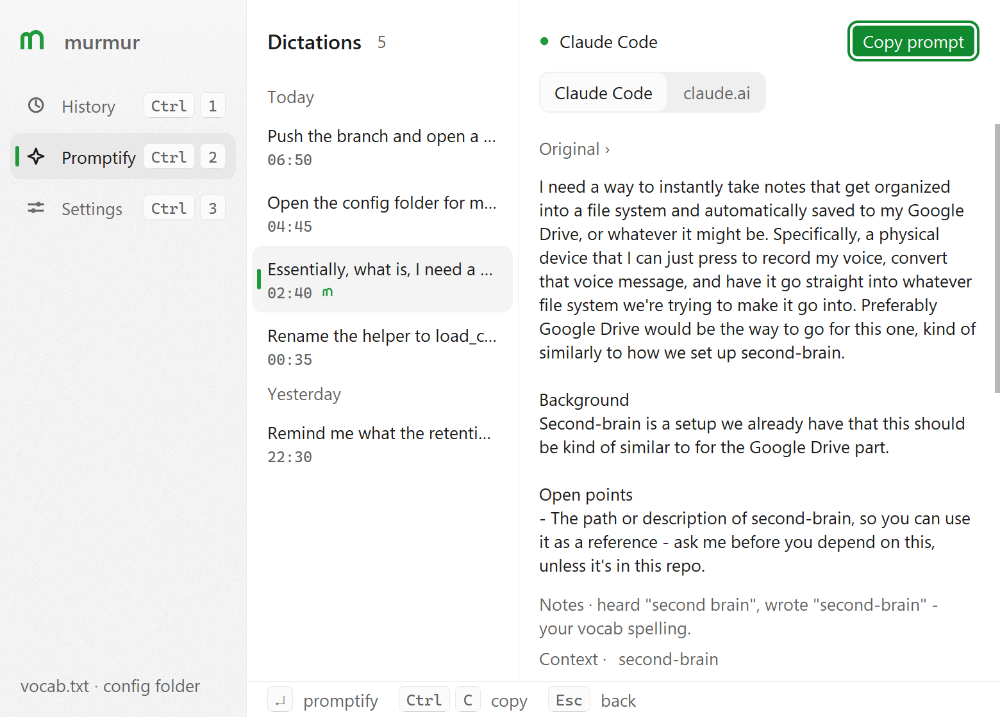
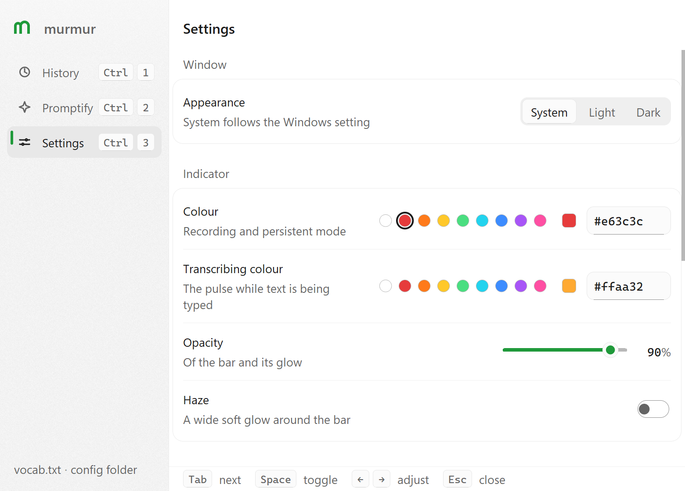

<p align="center"></p>

<p align="center">Hold <b>Ctrl+Win</b>, talk, let go.<br>What you said gets typed into whatever window has focus.</p>

<p align="center"></p>

**Completely local.** [faster-whisper](https://github.com/SYSTRAN/faster-whisper) runs
on your own CPU; your voice never leaves the machine. And **no language model "cleans up"
your words** - `rebase`, `tmux`, `GDScript` come out as you said them. A `vocab.txt` of
your own terms is handed to Whisper as a prompt so it prefers those spellings.

## Why not the others

| | murmur | Win+H voice typing | cloud AI dictation (Wispr Flow etc.) | raw Whisper (CLI / whisper.cpp) |
|---|---|---|---|---|
| Where your audio goes | this machine, then discarded | Microsoft's speech service | their servers | this machine |
| Rewrites your words | never | punctuation only | an LLM restyles them - that's the product | never |
| Your own terms | `vocab.txt`, per-spelling | no | varies, cloud-side | roll your own prompt |
| Types into the focused app | yes, streaming while you talk | yes | yes | no - file in, text out |
| Transcript history | 7 days, a local file you own | no | their account | no |
| Price | free | free | subscription | free |

Whisper itself is the right engine - murmur is the missing desktop half: the global hotkey,
the streaming that commits text while you are still talking, the vocab wiring, the typing into
whatever has focus, and a history file for the paste that went missing. If you want your
sentences reworded on the way through, murmur is the wrong tool on purpose.

The trade: Windows only, CPU-sized models (a sentence in ~1-2 s on a laptop), and English-tuned
models by default (multilingual ones are a Settings switch away).

## Everything stays on this machine

Cloud dictation tools stream your microphone to a server and hand the transcript to an LLM
before it reaches you. murmur has no server side at all:

- **Audio** is recorded into memory, transcribed by Whisper on this computer, and discarded.
  No account, no API key, no telemetry.
- **Network** is used exactly once: the first run downloads the model (~150 MB) from Hugging
  Face. After that murmur checks the local copy first and never goes online again - it works
  with Wi-Fi off.
- **Text** goes to your clipboard and, if you keep history on, to
  `%APPDATA%\murmur\history.jsonl` - a plain file you can read, prune (Settings > retention,
  0 keeps nothing) or delete. The log next to it (`murmur.log`) records timings and word
  counts, never the words.
- **Nothing rewrites you.** What Whisper hears is what gets typed, technical terms included.
- **One opt-in exception:** the Promptify button (below) sends *that one dictation* to an LLM
  you choose, on your own login, and only when you press it. The transcript itself is never
  changed, and the log still records timings, never text.

## Install

Grab `murmur-setup.exe` from the [Releases](https://github.com/BlueRaddish/murmur/releases)
page. Per-user install, no admin; tick "Start murmur when I sign in". It lives in the tray.

Or from source:

```
pip install -r requirements.txt
python murmur.py
```

### The first five minutes

1. Start murmur - a tiny glass stick appears at the bottom of the screen and pulses while the
   model downloads (`base.en`, ~150 MB, first run only).
2. Click into any text field, hold **Ctrl+Win**, say a sentence, let go. It types.
3. Thinking out loud? **Double-tap Ctrl+Win** and it keeps recording until you press again.
4. **Triple-tap Ctrl+Win** to open the murmur window: everything you dictated in the last
   7 days, ready to copy back.
5. Whisper mangles a project term? Tray icon > **Edit vocab.txt**, add the spelling, restart.
6. Optional: in the window's **Promptify** section, connect an engine and turn any rambling
   take into a clean prompt for Claude.

## Use

| Action | What happens |
|---|---|
| Hold Ctrl+Win, speak, release | text is typed where the cursor is |
| Double-tap Ctrl+Win | **persistent mode**: keeps recording until you press Ctrl+Win again |
| Triple-tap Ctrl+Win | opens the murmur window |
| Trigger key (opt-in) | one key with the same grammar: hold to record, double-tap for persistent, triple-tap for the window |
| Tray icon right-click | start/stop, edit vocab, open log, quit |

(Ctrl+Cmd on a Mac keyboard.) The glass stick is near-invisible at rest. While you talk it
turns red and becomes a live spectrum of your voice - one glowing shape that swells and
ripples across its whole length and pinches back into the stick at the tips, then relaxes
slowly when you stop; it auto-scales to your mic. Colours, opacity and haze are yours:
Settings has an accent colour (recording) and a transcribing colour with preset swatches, an
opacity slider and a haze toggle; every change applies as you make it. An orange-to-yellow
pulse runs along it while transcribing. If the bar stays flat while you talk, it is
listening to the wrong input: pick the microphone in Settings.

**Latency.** Transcription runs while you are still talking: every 6 s or so of new speech
is decoded in the background and everything up to the last segment boundary Whisper itself
found is committed; that last segment is decoded again with the next window. Cuts happen only
where Whisper ends a segment with the continuation in view - the same boundaries a whole-take
transcription produces - never at a silence detector's idea of a pause (that was tried and
turned a dictation into fragments).
On release only the window in flight and the tail are left, so a two-minute dictation lands
in seconds instead of half a minute. Each Whisper call costs about the same (~1 s on an idle
CPU, 4-5 s on a busy one) whether it gets 3 s or 15 s of audio, which is why windows are
medium-sized and never word-sized. While it works murmur raises its own process priority a
notch, which on a busy machine halves the time. `beam_size` in `config.json` is 5 (Whisper's
classic); 1 is greedy and 1.6x faster. Decoding is one deterministic pass: Whisper's retry
ladder (re-decoding at rising temperatures whenever confidence dips) is off, because on an
ordinary sentence it cost 20 s and kept a random sample. `"streaming": false` in
`config.json` transcribes each take whole at release instead.
`small.en` is noticeably more accurate on technical terms than the default `base.en`, at
about twice the time per pass; switch in Settings if you prefer accuracy.

## The window

Triple-tap the chord, or double-click the tray icon.

**History** - everything transcribed in the last 7 days: copy it back if a paste went missing
or you overwrote the clipboard, **edit** it when Whisper misheard a word (the fix is what
Promptify then works from), delete one (undo offered) or clear all. The retention window is
adjustable in Settings (0 keeps nothing). Stored in `%APPDATA%\murmur\history.jsonl`, local
only.

<picture>
<source media="(prefers-color-scheme: dark)" srcset="docs/history-dark.png">

</picture>

**Promptify** - open the Promptify section (or press Promptify / Ctrl+D on a History entry)
to turn a rambling take into a prompt for Claude: the goal first, in your words, your terms
and decisions kept verbatim, musings kept as open points, and at most three questions about
the things only you can answer (scope, which repo, how many, what "done" looks like). Answer
by clicking a chip, typing, or holding the chord and talking into the field - or press
**Assume** and the engine decides that one itself and says what it assumed; Update prompt
folds the answers in; Copy prompt, paste into Claude Code (or claude.ai - the toggle changes
how references to "the repo" are handled). The draft stays on the entry. One take is one
prompt; if you'd rather have unrelated asks in a single take come out as separate prompts,
turn on Split into prompts in Promptify > Engines.

<picture>
<source media="(prefers-color-scheme: dark)" srcset="docs/promptify-dark.png">

</picture>

The engine that writes the prompt signs in on its own, in your browser - Promptify >
Engines > Connect: Claude Code (your claude.ai subscription), Codex (your ChatGPT plan),
Gemini CLI (your Google account) or OpenRouter (one sign-in that reaches Claude, GPT and
Gemini models, free ones included). murmur keeps no keys: the three CLIs hold their own
logins and murmur only runs the binary you signed into; the OpenRouter key its connect flow
hands back is the one thing stored, in `%APPDATA%\murmur`. Nothing runs until you press the
button, and the first press says where the words go.

**Promptify + your Obsidian vault.** Turn the vault on in Promptify > Engines and murmur
looks a dictation's referents up in your own notes before drafting: say "like how we set up
second-brain" and the engine gets a short excerpt from that note instead of asking you where
it lives. Matching is by note names against your spoken words, all local, from a small cached
index of names, tags and first lines (the vault itself is never read while you wait); the
excerpts travel only with that one dictation, only to the engine you chose, and
the draft lists which notes were used (click one to open it in Obsidian). Private-looking
folders (journal, diary, private, people) are never indexed, and you can exclude more. Off
by default.

**Settings** - light or dark (or follow Windows), model, microphone, colours, retention,
the trigger key; changes apply as you make them.

<picture>
<source media="(prefers-color-scheme: dark)" srcset="docs/settings-dark.png">

</picture>

**Extra trigger key.** Settings > Trigger key > Change... binds any single key - a wired
headset's inline button, a media key, F13 on a macro pad - with the same grammar as the
chord: hold it to record, double-tap for persistent mode, triple-tap for the window. murmur
swallows that key so nothing else reacts to it, and it is never turned into a Ctrl+Win
keystroke, so nothing extra reaches the app you're typing into. Different headsets send
different codes; the capture records whatever yours sends (the log shows the code).

## Options

Settings in the app window (changes apply at once; model, microphone and language after a
restart), or `%APPDATA%\murmur\config.json`; command-line flags override for one run.

```
--model tiny.en|base.en|small.en|medium.en|large-v3   default base.en
--device cpu|cuda                                     cuda needs an NVIDIA GPU + CUDA libs
--language en|ko|...                                  default: en for *.en models, else auto
--mic 2  or  --mic "Headset"                          pick an input; see --list-devices
--trigger-vk 0xB3                                     key code bound as the trigger key (0xB3 = Play/Pause)
--console                                             no tray/pill, log to the terminal
```

`base.en` (the default) is the middle ground: quick on a CPU and fine for everyday
sentences. `tiny.en` is near-instant but sloppy; `small.en` is noticeably more accurate on
technical terms and still ~1-2 s for a sentence on a laptop CPU. Multilingual dictation: use a
model without `.en` (`small`, `medium`, `large-v3`).

## vocab.txt

`%APPDATA%\murmur\vocab.txt` (tray menu > Edit vocab.txt). One term or comma-separated
group per line, `#` for comments. Add whatever Whisper keeps mangling. Too long a list
dilutes itself; a few dozen terms is the sweet spot. Restart murmur after editing.

## Build

```
pip install -r requirements.txt pyinstaller
winget install JRSoftware.InnoSetup      # optional, for the installer
.\build.ps1                              # dist\murmur\murmur.exe and dist\murmur-setup.exe
```

## How it works

`pynput` listens for the chord globally. While held, `sounddevice` records the mic at
16 kHz and a background thread keeps transcribing with faster-whisper (int8 on CPU): once 6 s
of new audio have piled up a window (up to 30 s) is decoded, every segment but the last is
committed and the pointer moves to where that last segment starts. On release the remaining
tail is transcribed, the committed text is joined in front, the whole thing is placed on the
clipboard and Ctrl+V is sent; the text stays on the clipboard afterwards. The model is loaded
from the local cache without asking Hugging Face first, and CTranslate2's OpenMP threads are
told not to spin-wait (`KMP_BLOCKTIME=0`), which matters on a busy CPU. `overlay.py` renders
the stick with PIL into a per-pixel-alpha layered window (crisp at any DPI, click-through);
`window.py` is the tkinter history/settings window; the tray icon is pystray.

## Test

```
python tests/test_murmur.py
```

Drives the hold/double-tap/triple-tap/trigger-key state machine with fake key events, then
synthesizes a sentence with Windows TTS and checks Whisper gets the technical words back.
`tests/test_window.py` drives the window, `tests/test_brand.py` pins the mark to Chrome's
raster of the SVG, and `tests/test_promptify.py` runs the engine layer against fake CLIs
(envelopes, JSONL, auth errors, timeout, cancel) - no login or network needed. `./test.sh`
runs them all.

---

<p align="center"><br><sub>murmur is one
person's tool, made public. If it types for you, a star is how the next person finds it.</sub></p>
